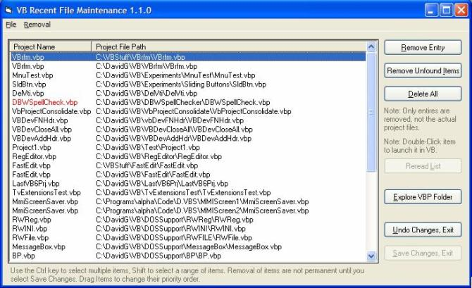



## VB6 Recent File Maintenance

### Description

Handy utility for cleaning out the cobwebs from your VB6 Recent File list. Selective removal of entries you don’t want listed, remove now-non-existent links, move entries in priority (top-most), explore folders containing valid VBP links. This app also demonstrates a custom collection class that feature Clear and Sort extensions, detecting and activating a previous instance of a program, registry I/O, and finding file extension-associated executables, XP-style buttons, etc. All these extensions are in self-contained classes and module, fully documented and ready to plug into your own apps.
 
### More Info
 

             |
---                |---
**Submitted On**   |2004-02-14 22:37:26
**By**             |[David Ross Goben](https://github.com/Planet-Source-Code/PSCIndex/blob/master/ByAuthor/david-ross-goben.md)
**Level**          |Intermediate
**User Rating**    |5.0 (25 globes from 5 users)
**Compatibility**  |VB 6\.0
**Category**       |[Complete Applications](https://github.com/Planet-Source-Code/PSCIndex/blob/master/ByCategory/complete-applications__1-27.md)
**World**          |[Visual Basic](https://github.com/Planet-Source-Code/PSCIndex/blob/master/ByWorld/visual-basic.md)
**Archive File**   |[VB6\_Recent1709002142004\.zip](https://github.com/Planet-Source-Code/david-ross-goben-vb6-recent-file-maintenance__1-51758/archive/master.zip)

